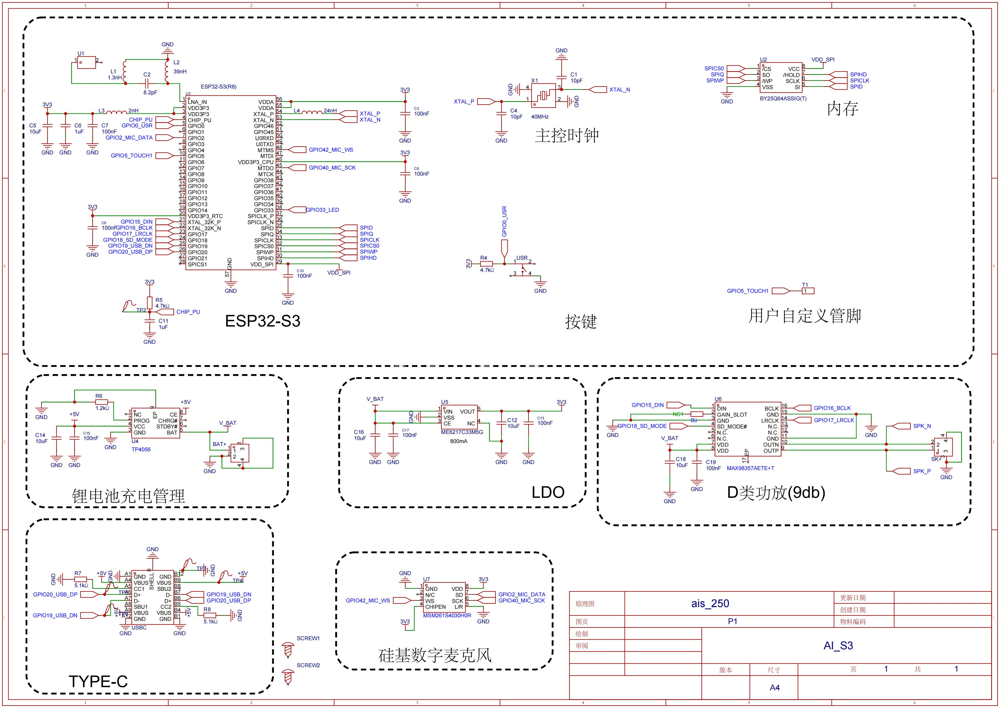

# 代码fork自
https://github.com/78/xiaozhi-esp32
早期版本，代码精简便于二次开发

# 开发环境
esp32-s3-r8
ESP-IDF 5.3.0及以上
Vscode

下载后用Vscode打开，选择“ESP-IDF:Open with IDF Extension”即可打开项目，选择芯片esp32-s3，编译下载

# 原理图


# Log打印
通过Type-C USB 可以查看

# 移植代码
因xiaozhi-esp32更新频繁，可前往移植https://github.com/78/xiaozhi-esp32

# 小智 AI 聊天机器人

BiliBili 视频介绍 [【ESP32+SenseVoice+Qwen72B打造你的AI聊天伴侣！】](https://www.bilibili.com/video/BV11msTenEH3/?share_source=copy_web&vd_source=ee1aafe19d6e60cf22e60a93881faeba)


### MAX98357功放和MSM261S4030H0R 数字麦克风 

```
接线方式可全局搜索“AUDIO_DEVICE_I2S_GPIO_BCLK”即可查看
```

### 配置项目与编译固件

- ESP32 S3 R8，Flash 8MB
- 配置 OTA Version URL 为 `https://api.tenclass.net/xiaozhi/ota/`
- 配置 WebSocket URL 为 `wss://api.tenclass.net/xiaozhi/v1/`
- 配置 WebSocket Access Token 为 `test-token`
- 配置完成后，编译固件


## 配置 Wi-Fi

打开手机 Wi-Fi，连接上设备热点 `Xiaozhi-xxxx` 后，使用浏览器访问 `http://192.168.4.1`，进入配网页面。

选择你的路由器 WiFi，输入密码，点击连接，设备会在 3 秒后自动重启，之后设备会自动连接到路由器。


